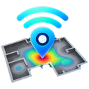
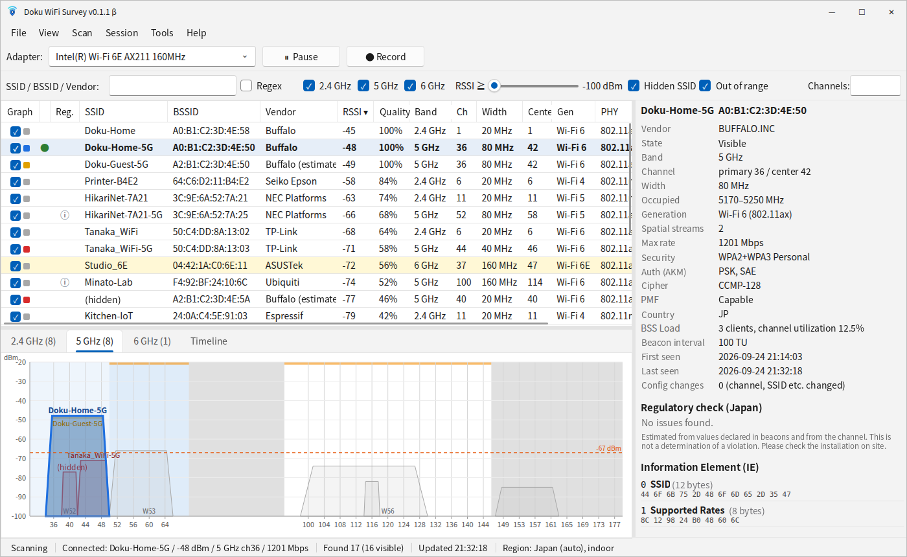

  

[日本語](README.md) | **English**

# Doku WiFi Survey (beta)

A Windows app that shows nearby Wi-Fi access points in a list and graphs.
Check channel congestion, signal strength over time, security settings, and whether a channel is allowed under local radio regulations (Japan / US / EU).

> This is a **public beta for evaluation**. It may contain bugs. Feedback is very welcome.

Network names and addresses in the screenshot are fictitious.

## Features

- Detailed AP list: SSID, BSSID, vendor, RSSI, channel, width, generation, max rate, security, PMF, country, BSS Load, and more
- Channel graphs for 2.4 / 5 / 6 GHz and a signal-strength timeline
- Wi-Fi 6E / 7 support (6 GHz, 320 MHz channels, MLO)
- Regulatory checks for Japan, US and EU (indoor-only bands, DFS, channels not permitted in the region)
- Record and replay survey sessions, export to CSV, copy the list to Excel
- Detailed view of every beacon information element (IE)
- English / Japanese UI, light and dark themes
- x64 and ARM64 builds

## Download

👉 **[Download the latest version](../../releases/latest)**

Under "Assets" at the bottom of the page, pick the file for your PC.

| PC type | File |
|---|---|
| Typical Windows PC (Intel / AMD) | `…_setup_x64.exe` |
| ARM Windows PC (Snapdragon, etc.) | `…_setup_arm64.exe` |

If you are not sure, choose x64 (most PCs).

## Installation

1. Double-click the downloaded exe.
2. If a blue "**Windows protected your PC**" screen appears, click **More info** → **Run anyway**.
   (This appears because the beta is not code-signed.)
3. Follow the installer. Administrator rights are not required.
4. On first launch, Windows asks for **Location** permission.
   Windows requires it for apps that scan Wi-Fi. The app does not record or send your location.

To update, install the new version over the old one. Your settings and recordings are kept.
You can check your version under **Help → About**.

> After updating, the desktop or taskbar icon may still look old (or blank). Windows caches icons; restarting the PC shows the new icon.

## Requirements

- Windows 11 / Windows 10 (64-bit)
- A wireless LAN (Wi-Fi) adapter
- To see 6 GHz (Wi-Fi 6E / 7) networks, your adapter must support 6 GHz

## How to use

See **Help → How to use** (F1) in the app.

- Click a column header to sort; right-click it to choose which columns to show
- Use the graph tabs (2.4 GHz / 5 GHz / 6 GHz / Timeline) to see channel overlap and signal changes
- **Session → Start recording** saves measurements so you can replay them later
- **Tools → Settings** (Ctrl+,) changes the theme (light / dark) and language (日本語 / English)
- The app follows your Windows display language by default (Japanese if Windows is in Japanese, otherwise English)

## Changelog

| Version | Changes |
|---|---|
| v0.1.1 beta | Added icons to the app and installer |
| v0.1.0 beta | First beta |

Per-build details are on the [Releases](../../releases) page.

## Expiration

Beta builds expire about 90 days after they are built.
The app shows a notice two weeks before expiry; please install the latest version from this page.

## Bugs and feedback

Questions, bug reports and feature requests are all welcome — in English or Japanese.

- Email: wifisurvey@dokurock.info
- GitHub [Issues](https://github.com/toku565/doku-wifi-survey-beta/issues) (if you have a GitHub account)

For bugs, attaching the zip created by **Help → Save diagnostic information** helps a lot (optional).

Note: Issues are public, so please send the zip by email.

## Notes

- Regulatory checks are **for reference only**, based on public information. Accuracy is not guaranteed. Always follow the official laws and regulations of your country.
- The beta is free for evaluation. The author is not liable for any damage caused by using this app.
- Please do not redistribute the app. Share a link to this page instead.

---
© 2026 doku
