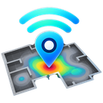

  

# Doku WiFi Survey（β 版）

周りの Wi-Fi（アクセスポイント）を一覧とグラフで見られる Windows アプリです。
チャネルの混み具合、電波の強さの変化、セキュリティの設定、日本の電波法で使えないチャネルかどうか、などを確認できます。

> これは**評価用の β 版**です。不具合があるかもしれません。気づいたことがあれば気軽に教えてください。

## ダウンロード

👉 **[最新版のダウンロードはこちら](../../releases/latest)**

ページ下の「Assets」から、使っている PC に合う方を選んでください。

| PC の種類 | ファイル |
|---|---|
| ふつうの Windows PC（Intel / AMD） | `…_setup_x64.exe` |
| Snapdragon など ARM の Windows PC | `…_setup_arm64.exe` |

わからなければ x64 の方で大丈夫です（ほとんどの PC はこちら）。

## インストール

1. ダウンロードした exe をダブルクリックします。
2. 「**Windows によって PC が保護されました**」と青い画面が出たら、**詳細情報** → **実行** を押します。
   （β 版は電子署名をしていないため表示されます）
3. 画面の案内どおりに進めます。管理者の権限は不要です。
4. 初めて起動すると、Windows の「**位置情報**」の許可を求められます。
   周りの Wi-Fi を調べるのに Windows が必要とする許可です。アプリが位置情報を記録・送信することはありません。

新しい版が出たら、同じように上書きインストールしてください。設定と記録はそのまま残ります。
使っている版は、アプリの **ヘルプ → バージョン情報** で確認できます。

> 上書きしたあとも、デスクトップやタスクバーのアイコンが前のまま（または白紙）に見えることがあります。Windows がアイコンを覚えているためで、PC を再起動すると新しいアイコンに変わります。

## 動く環境

- Windows 11 / Windows 10（64 ビット）
- 無線 LAN（Wi-Fi）アダプタ
- 6 GHz（Wi-Fi 6E / 7）の電波を見るには、アダプタが 6 GHz に対応している必要があります

## 使い方

アプリの **ヘルプ → 使い方**（F1 キー）に説明があります。

- 一覧の列見出しをクリックすると並べ替え、右クリックで表示する列を選べます
- 下のグラフのタブ（2.4 GHz / 5 GHz / 6 GHz / 時系列）でチャネルの重なりや強さの変化を確認できます
- **セッション → 記録を開始** で測定結果を保存して、あとで再生できます
- **ツール → 設定**（Ctrl+,）でテーマ（ライト / ダーク）や言語（日本語 / English）を変えられます

## 更新履歴

| 版 | 内容 |
|---|---|
| v0.1.1 β | アプリとインストーラーにアイコンを付けました |
| v0.1.0 β | 最初の β 版 |

細かい修正を含むビルドごとの一覧は [Releases](../../releases) にあります。

## 有効期限

β 版には有効期限があります（ビルドからおよそ 90 日）。
期限の 2 週間前からアプリ内でお知らせが出るので、このページから新しい版を入れ直してください。

## 不具合・要望の送り方

1. アプリの **ヘルプ → 診断情報を保存** で zip ファイルを作ります
   （ログ・設定・アダプタの情報が入ります。周りの Wi-Fi の名前は入りません）
2. 何をしたらどうなったかを書いて、zip と一緒に作者へ直接（LINE など）送ってください

画面のスクリーンショットがあると助かります。

## ご注意

- 規制チェック（使えないチャネルなどの表示）は、公開情報をもとにした**参考情報**です。正確さは保証できません。実際の判断は各国の法令・公式情報に従ってください。
- β 版は無償の評価用です。本アプリの使用によって生じた損害について、作者は責任を負いません。
- 再配布はご遠慮ください（ほしい人がいたら、このページを教えてあげてください）。

---
© 2026 doku
